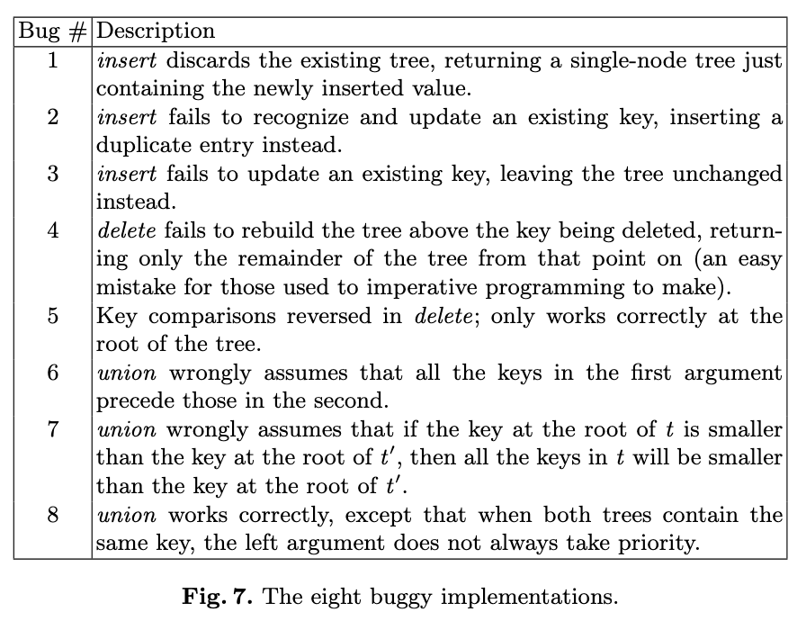

# *How to Specify It* Case Study

- This subdirectory contains 1 correct implementation of BSTs ([`bst.ml`](./bst.ml)), along with 8 buggy ones ([`bst1.ml`](./bst1.ml), [`bst2.ml`](./bst2.ml), ..., [`bst8.ml`](./bst8.ml)), based on [John Hughes's Haskell artifact](https://github.com/rjmh/how-to-specify-it/) for [*How to Specify It* (TFP '19)](https://research.chalmers.se/publication/517894/file/517894_Fulltext.pdf). 
- The BST implementations were manually ported from Haskell to OCaml, with the bugs preserved
  - There are inline comments in each of the buggy BST files (e.g. [`bst1.ml`](./bst1.ml)) describing the bug. 
- The code automatically produced by Mica can be found in [`mica_how_to_specify_it.ml`](./mica_how_to_specify_it.ml)

Here are the descriptions of all 8 bugs (taken from *How to Specify It*):             

